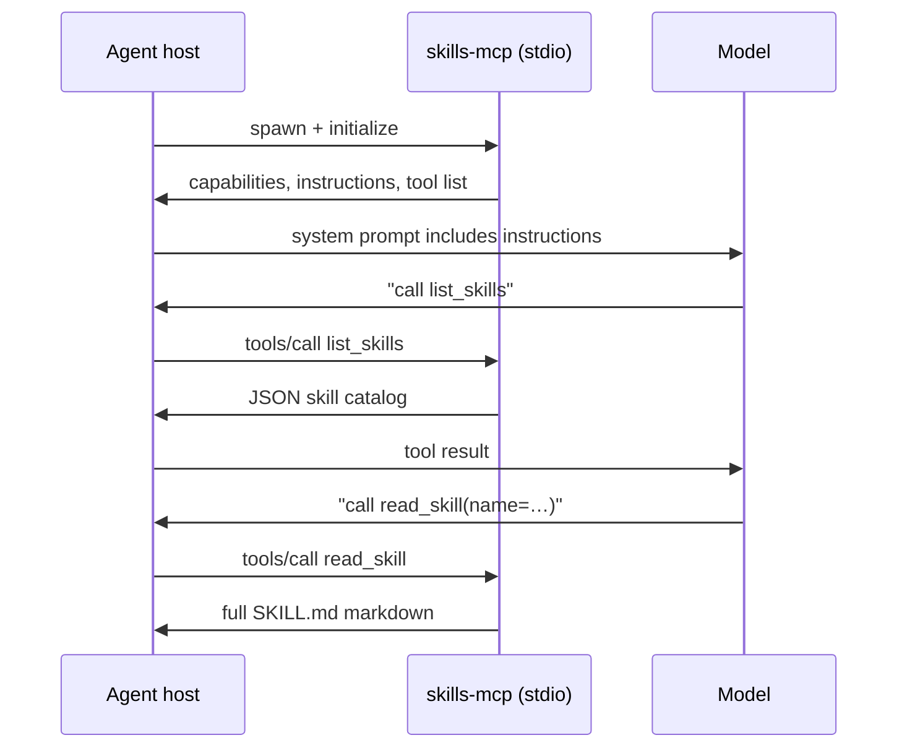

# About SkillMCP

SkillMCP is a **local MCP server** that delivers project skills and behavioral rules to AI coding agents (Cursor, Claude Code, Gemini CLI, Antigravity). This document explains how MCP works in general, how SkillMCP uses it, and how to run SkillMCP on its own—without the parent Agents workspace.

For install steps and CLI commands, see [README.md](README.md).

---

## What MCP is

The [Model Context Protocol (MCP)](https://modelcontextprotocol.io/) is a small JSON-RPC protocol between two processes:

| Role | Process | Responsibility |
|------|---------|----------------|
| **Host** | Your IDE or CLI (Cursor, Claude Code, …) | Spawns the server, passes tool results to the LLM |
| **Server** | SkillMCP (`skills-mcp serve`) | Exposes **tools** (callable functions) and optional **instructions** (static text for the model) |

The host and server talk over a transport. SkillMCP uses **stdio**: the host runs `python -m skills_mcp serve` as a child process and reads/writes JSON-RPC messages on stdin/stdout. No HTTP port, no cloud dependency.

Typical session flow:



The model never talks to SkillMCP directly. The **host** implements MCP on behalf of the agent and surfaces tools the same way it surfaces built-in tools (file read, terminal, etc.).

---

## Instructions vs tools

MCP servers can provide two kinds of guidance:

### Instructions (always on)

A single text block the host may inject into the agent’s system context at session start. SkillMCP builds this from:

1. A fixed preamble (session rituals: call `list_skills`, then `read_skill` when relevant).
2. Concatenated `AGENT.md` files from every configured agent folder (plus the optional bundled library).

In `src/skills_mcp/rules/instructions.py`, `render_mcp_seed_text()` merges the preamble with all `AGENT.md` content:

```python
def render_mcp_seed_text(*, agent_md_content: str | None = None, ...) -> str:
    if agent_md_content:
        seed = _BASE + "\n## Rules\n\n" + agent_md_content
    else:
        seed = _BASE
    return seed  # optionally truncated via SKILLS_MCP_RULES_INSTRUCTIONS_MAX_CHARS
```

At configure time (`src/skills_mcp/server.py`), the server assigns this string to FastMCP’s instructions field:

```python
agent_md = _load_agent_md(_APP.agent_dirs)
mcp._mcp_server.instructions = render_mcp_seed_text(agent_md_content=agent_md)
```

**Effect:** Every session starts with your project rules and the “call `list_skills` first” ritual—without the model having to remember to fetch them.

### Tools (on demand)

Tools are functions the model invokes when it needs more than the instructions block—for example, browsing the skill catalog or loading a full `SKILL.md`. SkillMCP exposes:

| Tool | Purpose |
|------|---------|
| `verify_setup` | Paths, config, skill count |
| `list_skills` | JSON metadata for all skills (global + optional project merge) |
| `read_skill` | Full markdown body for one skill by name |
| `list_skill_files` | JSON list of files under `references` / `scripts` / `assets` for one skill |
| `read_skill_file` | UTF-8 content of one referenced/script/asset file by relative path |
| `skill_health` | Server health and telemetry snapshot |

Tools are defined with FastMCP decorators; each returns a string (usually JSON):

```python
@mcp.tool()
def verify_setup(session_note: str = "") -> str:
    """One-call health snapshot: paths and skill counts."""
    return _run_traced("verify_setup", _impl_verify_setup)
```

**Effect:** Large skills stay out of context until the agent explicitly loads them via `read_skill`, and supplemental files can be pulled incrementally with `list_skill_files` + `read_skill_file`.

---

## How the host registers SkillMCP

`skills-mcp init` or `skills-mcp mcp register` writes an entry into each supported host config. The entry tells the host **which command to spawn** and **which project root** to pass:

From `src/skills_mcp/mcp_registration.py`:

```python
def _server_entry(project_root: Path) -> dict:
    root_path = str(project_root.resolve())
    env: dict[str, str] = {"SKILLS_MCP_ROOT": root_path}
    # optional bundled library → SKILLS_MCP_LIBRARY
    return {
        "command": sys.executable,
        "args": ["-m", "skills_mcp", "serve", "--root", root_path],
        "env": env,
    }
```

Example fragment in `~/.cursor/mcp.json` (after `init` on `/home/you/my-app`):

```json
{
  "mcpServers": {
    "skills-mcp": {
      "command": "/path/to/venv/bin/python",
      "args": ["-m", "skills_mcp", "serve", "--root", "/home/you/my-app"],
      "env": {
        "SKILLS_MCP_ROOT": "/home/you/my-app",
        "SKILLS_MCP_LIBRARY": "/path/to/SkillMCP/.agents"
      }
    }
  }
}
```

| Environment variable | Meaning |
|---------------------|---------|
| `SKILLS_MCP_ROOT` | Project directory containing `skillmcp.toml` |
| `SKILLS_MCP_LIBRARY` | Optional bundled agent folder (lowest priority; project folders win on name collision) |

The server discovers config by walking up from cwd for `skillmcp.toml`, or by using `SKILLS_MCP_ROOT` when set.

---

## Project layout SkillMCP reads

`skillmcp.toml` lists **agent folders** in priority order. Later entries override earlier ones for **skill names**; **all** `AGENT.md` files are merged for instructions.

```toml
agent_folders = [
    "/path/to/shared/agents",
    ".agents/",
]
```

Each agent folder:

```
.agents/
  AGENT.md          # rules → MCP instructions
  skills/
    my-skill/
      SKILL.md      # on-demand via read_skill
```

Skills use YAML frontmatter (`name`, `description`, optional `triggers`) plus a markdown body. The loader scans `skills/` under each agent folder and builds an in-memory index at server startup (refreshed each time the host spawns a new server process).

---

## Code examples

### 1. Calling SkillMCP from Python (MCP client)

This is how integration tests invoke tools without an IDE—same protocol the host uses:

```python
import asyncio
import json
import os
from pathlib import Path

from mcp import ClientSession
from mcp.client.stdio import StdioServerParameters, stdio_client

PROJECT_ROOT = Path("/path/to/your-project")  # must contain skillmcp.toml


async def call_skillmcp(tool: str, arguments: dict | None = None) -> str:
    params = StdioServerParameters(
        command="python",
        args=["-m", "skills_mcp", "serve"],
        env={**os.environ, "SKILLS_MCP_ROOT": str(PROJECT_ROOT)},
    )
    async with stdio_client(params) as (read, write):
        async with ClientSession(read, write) as session:
            await session.initialize()
            result = await session.call_tool(tool, arguments=arguments or {})
            return "".join(
                p.text if hasattr(p, "text") else str(p)
                for p in result.content
            )


async def main() -> None:
    # List available skills
    catalog = json.loads(await call_skillmcp("list_skills"))
    print("skills:", [s["name"] for s in catalog])

    # Load one skill's full markdown
    if catalog:
        name = catalog[0]["name"]
        body = await call_skillmcp("read_skill", {"name": name})
        print(f"--- {name} ---\n{body[:500]}…")


asyncio.run(main())
```

### 2. What the agent sees from `list_skills`

`list_skills` returns JSON metadata (not the full file):

```json
[
  {
    "name": "role-plan",
    "description": "Produce an execution-ready plan before writing code…",
    "path": ".agents/skills/role-plan/SKILL.md",
    "format": "directory",
    "skill_origin": "project"
  }
]
```

Pass `project_path` when the agent is working in a repo other than `SKILLS_MCP_ROOT` to merge that project’s local skills (local names win on collision):

```python
await call_skillmcp(
    "list_skills",
    {"project_path": "/path/to/other-repo"},
)
```

### 3. Adding a tool inside SkillMCP (server side)

SkillMCP is built with [FastMCP](https://github.com/modelcontextprotocol/python-sdk). A minimal additional tool would follow the same pattern as existing ones:

```python
from mcp.server.fastmcp import FastMCP

mcp = FastMCP("skills-mcp")

@mcp.tool()
def my_tool(example: str = "") -> str:
    """Short description shown to the model in the tool schema."""
    return f"hello {example}"

def run_stdio_server() -> None:
    mcp.run(transport="stdio")
```

In the real server, tools wrap `_run_traced()` so invocations are recorded in `telemetry.json` under the project root.

### 4. Manual host config (no `init`)

If you prefer not to run `skills-mcp mcp register`, add the server entry yourself. Use the same Python that has `skills-mcp` installed:

```json
{
  "mcpServers": {
    "skills-mcp": {
      "command": "skills-mcp",
      "args": ["serve", "--root", "/absolute/path/to/project"],
      "env": {
        "SKILLS_MCP_ROOT": "/absolute/path/to/project"
      }
    }
  }
}
```

On Windows, use the full path to `python.exe` in `command` if `skills-mcp` is not on PATH. Restart the host after editing MCP config.

---

## Independent install

SkillMCP is a **standalone Python package**. You do not need the parent Agents monorepo, LearnMCP, or claude-mem.

```bash
cd SkillMCP                # package root (clone or copy this directory)
uv sync                    # or: pip install -e .
cd /path/to/your-project
skills-mcp init .
```

After install, only these artifacts matter on your project:

| File / dir | Created by |
|------------|------------|
| `skillmcp.toml` | `init` |
| `.agents/AGENT.md` | `init` (if missing) |
| `.agents/skills/` | `init` |
| Host MCP config | `init` / `mcp register` |
| `telemetry.json` | server (optional metrics) |

Verify with:

```bash
skills-mcp doctor
skills-mcp serve --root /path/to/your-project   # runs until Ctrl+C; host normally spawns this for you
```

---

## Design choices (why it works this way)

**Stdio, not HTTP** — Local-only, no firewall rules, same pattern every MCP host supports.

**Instructions + tools** — Small rules and rituals are always present; large skills are pulled only when needed, keeping context lean.

**Hierarchy-walking `skillmcp.toml`** — Monorepos can place config at the repo root; nested packages can override with a closer config if you add one later.

**Last-wins skill merge** — Shared library in `SKILLS_MCP_LIBRARY` or early `agent_folders` entries; project-specific skills in later folders override by name.

**No background daemon** — The host spawns the server per session (or per connection). Simplicity over long-lived state; skill index is rebuilt on each spawn.

---

## Related projects

| Project | Role |
|---------|------|
| [LearnSkill](https://github.com/NVentimiglia/LearnSkill) | Session friction analysis (skill invoked on demand; complements SkillMCP) |
| [claude-mem](https://github.com/thedotmack/claude-mem) | Long-term semantic memory across sessions |

SkillMCP answers *what should the agent do?* Those tools answer *what went wrong in past sessions?* and *what happened before?*
